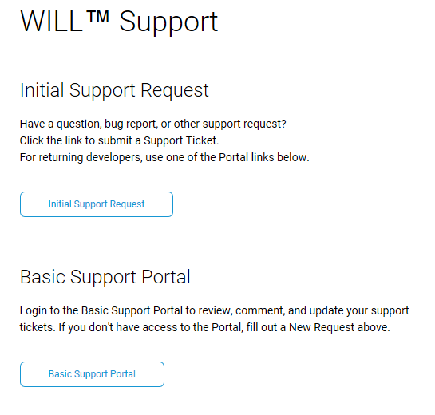
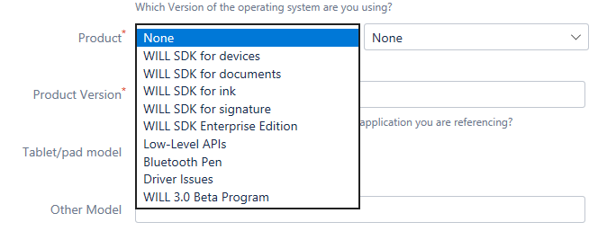

# Wacom-Developer-Welcome-Page

## Welcome to the Wacom Developer GitHub pages

Here you can find supplementary instructions and latest information for the developer repositories.

## SUPPORT PROCEDURE

For technical support with any of the products follow the link to [Wacom Developer Support](https://developer.wacom.com/en-us/developer-dashboard/support)

The link references the Wacom Developer website which needs a Wacom ID login to access the dashboard used for product download and support.

If you do not already have a Wacom ID create one using the link provided:

The email used as the Wacom ID will be used for support emails.
You can then access the support request page:

Select the Initial Support Request option to display the request form.
Complete the form, selecting the product under test:
 

After submitting the request you will then be able to monitor its status using the Basic Support Portal option.

---
