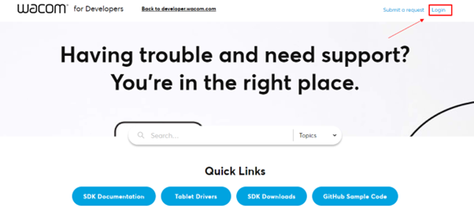
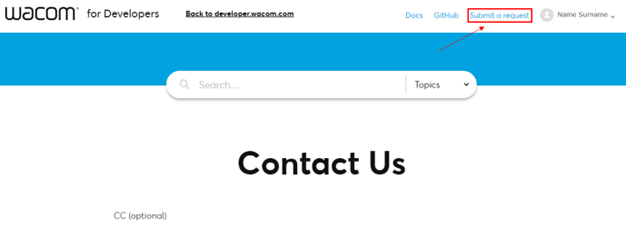

# Wacom Developer Welcome Page

## Welcome to the Wacom Developer GitHub pages

Here you can find supplementary instructions and latest information for the developer GitHub repositories.

The GitHub repositories have been created in support of the Wacom Developer Relations website described below.

## Developer Relations Site

Developing isn’t just about great technology, it’s about turning apps into profitable businesses. We can help you do that.

Wacom Developer Relations gives you access to the resources, connections and industries you need to succeed in the exciting and disruptive digital ink market. 

Access the Wacom Developer Relations site here: https://developer.wacom.com

### Wacom ID

To get the full benefits of using Wacom Developer Relations first login to the site:

On your first visit you will need to create a Wacom ID which will give you full access to the resources:

Simply complete the registration process:

You will then have full access to the resources made available on the site:

## Support Procedure

For technical support with any of the products follow the link to [Wacom Developer Support](https://developer.wacom.com/en-us/developer-dashboard/support)

The link references the Wacom Developer website which needs a Wacom ID login to access the dashboard used for product download and support.

If you do not already have a Wacom ID create one using the link provided:

The email used as the Wacom ID will be used for support emails.
You can then access the support request page:

Select the Initial Support Request option to display the request form.
Complete the form, selecting the product under test:
 

After submitting the request you will then be able to monitor its status using the Basic Support Portal option.

---
